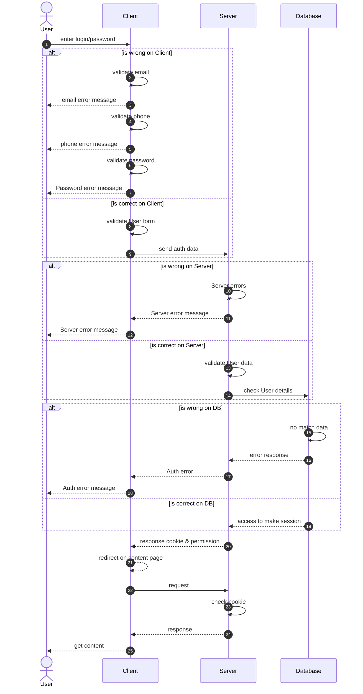

```mermaid
    sequenceDiagram
      autonumber
        actor U as User
        participant C as Client
        participant S as Server
        participant DB as Database
          U->>C: enter login/password
          alt is wrong on Client
          C-xC: validate email
          C-->>U: email error message
          C-xC: validate phone
          C-->>U: phone error message
          C-xC: validate password
          C-->>U: Password error message
          else is correct on Client
          C->>C: validate User form
          C->>S: send auth data
          end
          alt is wrong on Server
          S-xS: Server errors
          S-->>C: Server error message
          C-->>U: Server error message
          else is correct on Server
          S->>S: validate User data
          S->>DB: check User details
          end
          alt is wrong on DB
          DB-xDB: no match data
          DB-->>S: error response
          S-->>C: Auth error 
          C-->>U: Auth error message
          else is correct on DB
          DB-->>S: access to make session
          end
          S-->>C: response cookie & permission
          C-->>C: redirect on content page
          C->>S: request
          S->>S: check cookie
          S-->>C: response
          C-->> U: get content
```