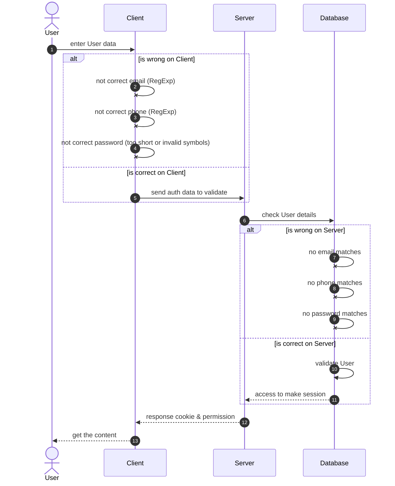

```mermaid
    sequenceDiagram
      autonumber
        actor U as User
        participant C as Client
        participant S as Server
        participant DB as Database
          U->>C: enter User data
          alt is wrong on Client
          C-xC: not correct email (RegExp)
          C-xC: not correct phone (RegExp)
          C-xC: not correct password (too short or invalid symbols)
          else is correct on Client
          C->>S: send auth data to validate
          end
          S->>DB: check User details
          alt is wrong on Server
          DB-xDB: no email matches
          DB-xDB: no phone matches
          DB-xDB: no password matches
          else is correct on Server
          DB->>DB: validate User
          DB-->>S: access to make session
          end
          S-->>C: response cookie & permission
          C-->>U: get the content
```