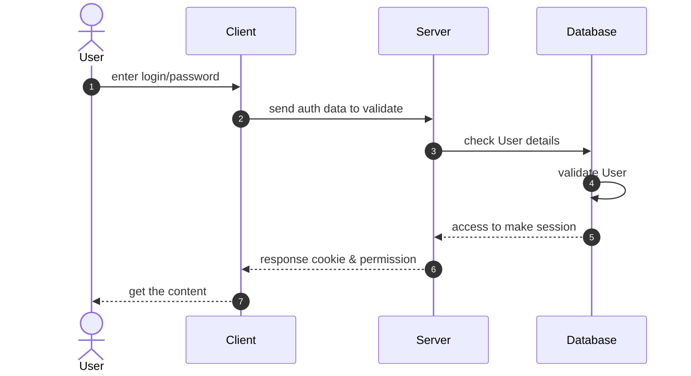

```mermaid
    sequenceDiagram
      autonumber
        actor U as User
        participant C as Client
        participant S as Server
        participant DB as Database
          U->>C: enter login/password
          C->>S: send auth data to validate
          S->>DB: check User details
          DB->>DB: validate User
          DB-->>S: access to make session
          S-->>C: response cookie & permission
          C-->>U: get the content
```