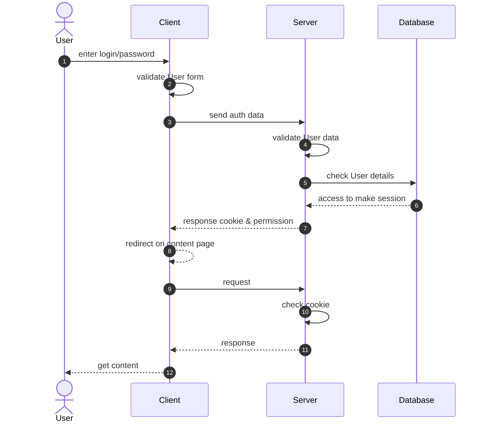

```mermaid
    sequenceDiagram
      autonumber
        actor U as User
        participant C as Client
        participant S as Server
        participant DB as Database
          U->>C: enter login/password
          C->>C: validate User form
          C->>S: send auth data
          S->>S: validate User data
          S->>DB: check User details
          DB-->>S: access to make session
          S-->>C: response cookie & permission
          C-->>C: redirect on content page
          C->>S: request
          S->>S: check cookie
          S-->>C: response
          C-->> U: get content
```